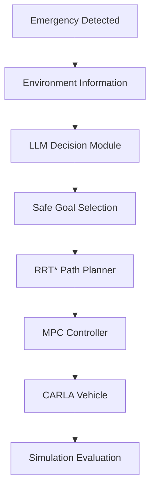

# CapDi(2)
# 🚗 LLM-Based Emergency Vehicle Path Planning and Control

> Development of an **LLM-assisted autonomous emergency driving system** that minimizes casualties during sudden unintended acceleration by integrating **Large Language Models (LLM), RRT* path planning, Model Predictive Control (MPC), and CARLA simulation**.

---

## 📖 Overview

This project presents an autonomous emergency driving framework designed to respond to **Sudden Unintended Acceleration (SUA)** scenarios.

Rather than simply attempting to avoid every obstacle, the system assumes that certain emergency situations may become unavoidable and instead focuses on generating trajectories that minimize overall human and environmental damage.

The framework combines modern autonomous driving technologies including:

- Large Language Model (LLM) for emergency decision making
- Risk-aware target generation
- RRT* path planning
- Model Predictive Control (MPC)
- CARLA simulation for validation

The proposed system demonstrates how AI-assisted planning can improve decision-making under highly uncertain and time-critical driving situations.

---

# 📷 Project Overview

<p align="center">
  
</p>

The emergency driving pipeline integrates perception, decision-making, planning, and control into a unified autonomous system capable of responding to sudden unintended acceleration events.

---

# 🚨 Motivation

Unexpected sudden acceleration accidents have caused severe casualties worldwide despite significant advances in modern vehicle safety systems.

Current Advanced Driver Assistance Systems (ADAS) mainly focus on:

- Collision warning
- Lane keeping
- Emergency braking

However, in extreme situations where collision becomes unavoidable, existing systems rarely consider minimizing overall damage.

This project investigates whether an AI-assisted autonomous framework can generate safer emergency trajectories by considering the surrounding environment and selecting actions that reduce casualties.

---

# 🧠 System Architecture



---

# ⚙️ System Pipeline

```text
Sudden Acceleration
        │
        ▼
Environment Analysis
        │
        ▼
LLM Situation Reasoning
        │
        ▼
Emergency Goal Selection
        │
        ▼
RRT* Path Planning
        │
        ▼
Trajectory Generation
        │
        ▼
Model Predictive Control
        │
        ▼
CARLA Vehicle Control
        │
        ▼
Simulation Evaluation
```

---

# 🤖 LLM Decision Module

The Large Language Model evaluates the emergency situation by considering:

- Road geometry
- Vehicle positions
- Pedestrian locations
- Collision probability
- Reachable safe areas

Instead of producing low-level control commands, the LLM determines an appropriate emergency objective that minimizes expected casualties.

### Inputs

- Ego vehicle state
- Dynamic obstacles
- Traffic conditions
- Road information

### Outputs

- Emergency target position
- Driving strategy
- High-level navigation objective

---

# 🛣 Path Planning

## RRT* (Rapidly-exploring Random Tree Star)

The emergency route is generated using RRT*, which provides asymptotically optimal sampling-based path planning.

### Features

- Randomized sampling
- Obstacle avoidance
- Collision-free trajectory generation
- Goal optimization
- Dynamic replanning capability

---

# 🚙 Vehicle Controller

## Model Predictive Control (MPC)

The generated trajectory is tracked using Model Predictive Control.

The controller minimizes:

- Lateral error
- Heading error
- Steering effort
- Control input variation

subject to vehicle dynamics constraints.

---

# 🌎 Simulation Environment

Simulation was performed using the CARLA autonomous driving simulator.

### Environment

- Urban roads
- Dynamic traffic
- Pedestrians
- Multiple intersections
- Traffic signals

### Validation

- Low traffic density
- Medium traffic density
- High traffic density
- Emergency avoidance scenarios

---

# 📊 Experimental Results

The proposed framework was evaluated under multiple emergency situations.

### Performance

✅ Successful emergency trajectory generation

✅ Stable MPC trajectory tracking

✅ Reduced collision severity

✅ Improved pedestrian safety

Representative simulation examples are shown below.

<p align="center">
  
</p>

---

# 📈 Discussion

## Advantages

- Integrates LLM with classical planning
- Modular architecture
- Robust trajectory tracking
- Flexible planning framework
- Easily expandable to new scenarios

---

## Limitations

- RRT* computation time increases in dense environments
- Path generation varies due to random sampling
- LLM inference latency must be considered
- Simulation-only validation

---

# 🚀 Future Work

- Real vehicle implementation
- Faster planning algorithms
- Dynamic obstacle prediction
- Multi-agent emergency reasoning
- Vision-Language Model integration
- Reinforcement learning assisted planning

---

# 💻 Tech Stack

| Category | Technologies |
|-----------|--------------|
| Programming | Python |
| Simulator | CARLA |
| AI | Large Language Model (LLM) |
| Planning | RRT* |
| Control | Model Predictive Control (MPC) |
| Optimization | NumPy, SciPy |
| Visualization | Matplotlib |

---

# 📂 Repository Structure

```text
.
├── carla/
│   ├── environment.py
│   ├── scenario.py
│   └── simulation.py
│
├── llm/
│   ├── decision.py
│   ├── prompt.py
│   └── parser.py
│
├── planner/
│   ├── rrt_star.py
│   ├── node.py
│   └── collision_checker.py
│
├── controller/
│   ├── mpc.py
│   └── vehicle_model.py
│
├── utils/
│
├── images/
│
├── videos/
│
└── README.md
```

---

# 📸 Simulation Gallery

## System Overview

<p align="center">
  
</p>

---

## CARLA Simulation

<p align="center">
  
</p>

---

## Emergency Path Planning

<p align="center">
  
</p>

---

## MPC Tracking

<p align="center">
  
</p>

---

# 🎯 Project Contributions

- Designed an **LLM-assisted emergency driving framework** for sudden unintended acceleration scenarios.
- Developed an emergency decision-making pipeline combining AI reasoning and classical robotics.
- Implemented **RRT*** for collision-aware emergency path planning.
- Designed an **MPC-based trajectory tracking controller**.
- Built an end-to-end autonomous driving simulation pipeline using **CARLA**.
- Evaluated system performance under multiple emergency scenarios.

---

# 📚 Keywords

- Autonomous Driving
- Large Language Model
- LLM
- Emergency Driving
- Sudden Unintended Acceleration
- Path Planning
- RRT*
- MPC
- CARLA
- Robotics
- Motion Planning
- Vehicle Control

---

# 📄 License

This project was developed as part of an academic capstone design project.

For research and educational purposes only.


Contributor

<div align="center">
  <table>
    <tr>
      <td align="center">
        <a href="https://github.com/Giromi">
          
        </a>
      </td>
      <td align="center">
        <a href="https://github.com/Heriot-Baek">
          
        </a>
      </td>
      <td align="center">
        <a href="https://github.com/devsangho">
          
        </a>
      </td>
      <td align="center">
        <a href="https://github.com/asd123278">
          
        </a>
      </td>
    </tr>
    <tr>
      <td align="center">
        <a href="https://github.com/Giromi">
          기계 17 김민수
        </a>
      </td>
      <td align="center">
        <a href="https://github.com/Heriot-Baek">
          기계 19 배우열
        </a>
      </td>
      <td align="center">
        <a href="https://github.com/devsangho">
          기계 19 윤상호
        </a>
      </td>
 <td align="center">
        <a href="https://github.com/asd123278">
          기계 19 장우혁
        </a>
      </td>
    </tr>
  </table>
</div>


