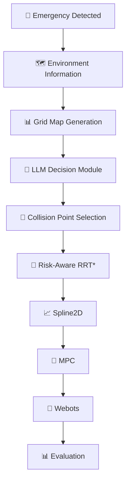
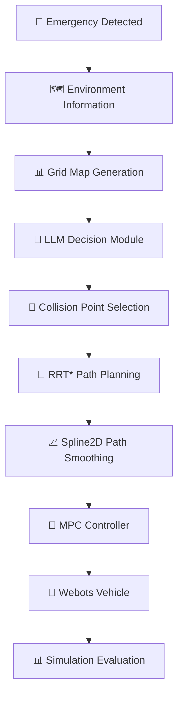
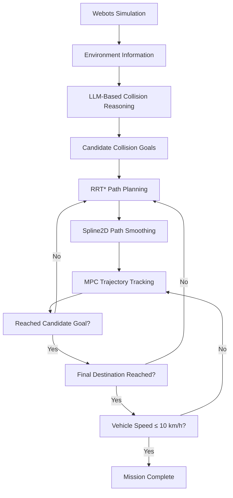

# 🚑 Risk-Aware Emergency Vehicle Path Planning using LLM, RRT*, Spline2D, and MPC

> An AI-assisted autonomous emergency planning framework that integrates **Large Language Models (LLMs), RRT*, Spline2D, and Model Predictive Control (MPC)** to minimize traffic casualties during Sudden Unintended Acceleration (SUA) scenarios.

## 📸 Project Highlights

| 🧠 LLM-Based Prompt Engineering | 🌳 Motion Planning & Trajectory Tracking | 🚑 End-to-End Emergency Planning |
|:-------------------------------:|:----------------------------------------:|:--------------------------------:|
|  |  |  |
| Structured prompt engineering for LLM-based collision reasoning | Integration of Risk-Aware RRT*, Spline2D, and MPC | End-to-end validation under Sudden Unintended Acceleration |


## 📑 Table of Contents

- [📖 Project Overview](#overview)
- [👨‍💻 My Contributions](#contributions)
- [🎯 Motivation](#motivation)
- [🏗️ System Architecture](#architecture)
- [⚙️ Methodology](#methodology)
  - [🧠 LLM-Based Collision Reasoning](#llm)
  - [🌳 Path Planning (RRT*)](#rrt)
  - [📈 Spline2D Trajectory Generation](#spline)
  - [🚗 Model Predictive Control (MPC)](#mpc)
- [🧪 Simulation Environment](#simulation)
- [📊 Experimental Scenarios](#experiments)
- [📈 Results](#results)
- [🛠️ Technologies](#technologies)
- [📂 Repository Structure](#repository)
- [🚀 Future Work](#future)
- [📚 Keywords](#keywords)

---

<a id="overview"></a>

# 📖 Project Overview

<p align="center">
  
</p>

This project presents an AI-assisted emergency planning framework for unavoidable traffic collision scenarios.

Instead of simply avoiding obstacles, the proposed framework combines **semantic reasoning from a Large Language Model (LLM)** with **classical motion planning** and **optimal vehicle control** to minimize overall human casualties.

The complete decision-making pipeline consists of:

```text
LLM
   ↓
Risk-Aware RRT*
   ↓
Spline2D
   ↓
Model Predictive Control
   ↓
Webots Simulation
```

The complete framework was validated through urban traffic simulations.

---

<a id="contributions"></a>

# 👨‍💻 My Contributions

## 🏗️ System Architecture

- Designed and integrated the complete autonomous planning pipeline connecting **LLM → Motion Planning → MPC → Webots**.
- Designed the overall software architecture and modular class hierarchy.
- Built reusable software interfaces to improve readability, maintainability, and scalability.

---

## 🧠 LLM-Based Decision Making

- Designed Few-Shot prompt engineering strategies for collision reasoning.
- Implemented map parsing modules for structured environment representation.
- Built the interface connecting LLM outputs to the downstream planning pipeline.

---

## 🛣️ Planning & Control Integration

- Designed and implemented the Spline2D trajectory generation module.
- Built the interface between motion planning and MPC trajectory tracking.
- Generated smooth reference trajectories suitable for real-time vehicle control.

---

## 🧪 Simulation & Validation

- Integrated the complete framework into Webots.
- Executed end-to-end simulation experiments under multiple traffic scenarios.
- Recorded demonstration videos.
- Performed debugging and system-level validation.

---

<a id="motivation"></a>

# 🎯 Motivation

Autonomous vehicles inevitably encounter situations where collisions cannot be completely avoided.

Instead of simply avoiding obstacles, autonomous systems should determine collision strategies that minimize overall human casualties.

This project investigates how **Large Language Models** can assist emergency decision-making while maintaining dynamically feasible trajectories through motion planning and optimal control.

---

<a id="architecture"></a>

# 🏗️ System Architecture



---

<a id="methodology"></a>

# ⚙️ Methodology

<a id="llm"></a>

## 🧠 LLM-Based Collision Reasoning

The proposed framework employs **Few-Shot Prompting** to improve emergency collision reasoning.

### Features

- Grid-map representation
- Few-Shot Prompt Engineering
- Collision point prediction
- Casualty-aware reasoning
- Zero-Shot vs Few-Shot comparison

---

<a id="rrt"></a>

## 🌳 Path Planning (RRT*)

After selecting the collision point, the planner generates a collision-aware trajectory using **RRT***.

### Features

- Collision-aware waypoint generation
- Global path planning
- Risk-aware trajectory generation
- Obstacle avoidance

---

<a id="spline"></a>

## 📈 Spline2D Trajectory Generation

The generated waypoints are interpolated using **Spline2D**, producing smooth and dynamically feasible trajectories for vehicle control.

### Features

- Smooth trajectory generation
- Continuous curvature
- Stable reference path generation
- MPC-compatible trajectories

---

<a id="mpc"></a>

## 🚗 Model Predictive Control (MPC)

The generated trajectory is tracked using **Model Predictive Control (MPC)**.

### Optimization Objectives

- Position tracking error
- Steering effort
- Steering rate
- Vehicle dynamics constraints
- Velocity constraints

### Optimization Problem

```math
\begin{aligned}
J=\arg\min_u
\sum_{k=0}^{N}
\left(
\|z_{k,\mathrm{ref}}-z_k\|_Q^2
+\|u_k\|_R^2
+\|u_{k+1}-u_k\|_{R_d}^2
\right)
\end{aligned}
```

---

<a id="simulation"></a>

# 🧪 Simulation Environment

The proposed framework was validated using **Webots**.

Simulation environment includes:

- Urban road scenarios
- Emergency navigation
- Dynamic traffic
- Collision-aware trajectory execution

---

<a id="experiments"></a>

# 📊 Experimental Scenarios

Experiments were conducted on multiple emergency traffic scenarios, including the **Seoul City Hall intersection**.

The proposed framework generated significantly safer collision strategies compared with conventional planning methods.

---

<a id="results"></a>

# 📈 Results

| Scenario | Actual Casualties | Proposed Framework |
|-----------|------------------:|-------------------:|
| Seoul City Hall Intersection | 16 | 3 |

### Performance

- ✅ LLM-based collision reasoning
- ✅ Few-Shot prompting
- ✅ Risk-aware path planning
- ✅ RRT*
- ✅ Spline2D smoothing
- ✅ MPC trajectory tracking
- ✅ End-to-end Webots validation

---

<a id="technologies"></a>

# 🛠️ Technologies

| Category | Technologies |
|-----------|--------------|
| AI | Large Language Models (LLM), Few-Shot Prompting |
| Planning | RRT*, Spline2D |
| Control | Model Predictive Control (MPC) |
| Simulation | Webots |
| Programming | Python |
| Libraries | NumPy, Matplotlib |

---

<a id="repository"></a>

# 📂 Repository Structure

```text
EmergencyPlanning/
│
├── llm/
├── planner/
├── controller/
├── simulation/
├── experiments/
├── results/
└── docs/
```

---

<a id="future"></a>

# 🚀 Future Work

- Vision-Language Model (VLM) integration
- Camera and LiDAR perception
- Dynamic obstacle prediction
- ROS2 deployment
- CARLA implementation
- Multi-agent emergency planning
- Real vehicle validation

---

<a id="keywords"></a>

# 📚 Keywords

`Autonomous Driving` · `Emergency Planning` · `Large Language Models` · `Few-Shot Learning` · `Motion Planning` · `RRT*` · `Spline2D` · `Model Predictive Control` · `Webots` · `Robotics`

# 🚑 Risk-Aware Emergency Vehicle Path Planning using LLM, RRT*, and MPC

> An AI-assisted autonomous emergency response system that minimizes traffic casualties by integrating **Large Language Models (LLMs), RRT*, Spline2D, and Model Predictive Control (MPC)**.

---
### MPC Optimization

The controller minimizes trajectory tracking error while satisfying vehicle dynamics and actuator constraints.

$$
\begin{alignedat}{3}
J &= \arg\min_{u}\sum_{k=0}^{N}
\left(
\|z_{k,\mathrm{ref}}-z_k\|_Q^2
+\|u_k\|_R^2
+\|u_{k+1}-u_k\|_{R_d}^2
\right) \\
\text{subject to}\qquad
&\|u_{k+1}-u_k\|<du_{\max} \\
\qquad&
v_{\min}<v_k<v_{\max} \\
&
u_{\min}<u_k<u_{\max} \\
&
z_0=z_{0,\mathrm{ob}} \\
\qquad&
z_{k+1}=Az_k+Bu+C \\
\end{alignedat}
$$

## 📖 Overview

This project presents an AI-assisted emergency vehicle planning framework for unavoidable traffic collision scenarios.

Unlike conventional autonomous driving systems that focus solely on obstacle avoidance, the proposed framework aims to **minimize human casualties** by combining semantic reasoning from a Large Language Model (LLM) with classical motion planning and optimal vehicle control.

The system first analyzes a traffic scene, predicts the safest collision point through LLM reasoning, generates an optimal path using RRT*, smooths the trajectory with Spline2D, and finally tracks the path using Model Predictive Control (MPC). The complete framework was validated through Webots simulations in urban traffic environments.

---

## 🎯 Motivation

Autonomous vehicles inevitably encounter situations where collisions cannot be completely avoided.

Instead of simply avoiding obstacles, autonomous systems should determine the collision strategy that minimizes overall human casualties.

This project investigates how Large Language Models can assist emergency decision-making while maintaining dynamically feasible trajectories for autonomous vehicles.

---

## 🏗 System Architecture



---

# 🧠 LLM-Based Collision Reasoning

The proposed framework employs **Few-Shot Prompting** to improve collision reasoning capability.

Instead of relying solely on Zero-Shot prompting, representative traffic accident examples are provided to the LLM, allowing it to infer safer collision points under emergency situations.

### Features

- Grid-map representation
- Few-Shot Prompt Engineering
- Collision point prediction
- Casualty-aware reasoning
- Zero-Shot vs Few-Shot comparison

---

# 🌳 Path Planning

After selecting the collision point, the planner generates a collision-aware trajectory using **RRT***.

The generated waypoints are then refined through **Spline2D interpolation**, producing a smooth and dynamically feasible trajectory.

### Features

- Collision-aware waypoint generation
- RRT* global planning
- Spline2D trajectory smoothing
- Curvature optimization

---

# 🚗 Model Predictive Control (MPC)

The generated trajectory is tracked using **Model Predictive Control (MPC)**.

The controller optimizes steering commands while satisfying vehicle dynamics and steering constraints.

### Optimization Objectives

- Position tracking error
- Steering effort
- Steering rate
- Vehicle dynamics constraints
- Velocity constraints

---

# 🖥 Simulation Environment

The proposed framework was validated using **Webots**.

Simulation environment includes:

- Urban road scenarios
- Dynamic traffic environments
- Emergency vehicle navigation
- Collision-aware trajectory execution

---

# 🧪 Experimental Scenario

Experiments were conducted on multiple urban traffic scenarios, including the **Seoul City Hall intersection**.

The proposed framework generated significantly safer collision strategies compared with conventional planning methods.

---

# 📊 Results

| Scenario | Actual Casualties | Proposed Framework |
|-----------|------------------:|-------------------:|
| Seoul City Hall Intersection | 16 | 3 |

### Performance

- ✅ LLM-based collision reasoning
- ✅ Few-Shot prompting
- ✅ Collision-aware planning
- ✅ RRT* path planning
- ✅ Spline2D smoothing
- ✅ MPC trajectory tracking
- ✅ Webots validation

---

# 🛠 Technologies

| Category | Technologies |
|-----------|--------------|
| AI | Large Language Models (LLM), Few-Shot Prompting |
| Planning | RRT*, Spline2D |
| Control | Model Predictive Control (MPC) |
| Simulation | Webots |
| Programming | Python |
| Libraries | NumPy, Matplotlib |

---

# 📂 Repository Structure

```text
EmergencyPlanning/
│
├── llm/
│   ├── prompts/
│   ├── reasoning/
│   └── collision_prediction/
│
├── planner/
│   ├── rrt_star/
│   ├── spline2d/
│   └── waypoint_generation/
│
├── controller/
│   ├── mpc/
│   └── vehicle_model/
│
├── simulation/
│   ├── webots/
│   ├── scenarios/
│   └── maps/
│
├── experiments/
│
├── results/
│
└── docs/
```

---

# 👨‍💻 My Contributions

- Designed the overall AI-assisted emergency planning framework.
- Developed the LLM-based collision reasoning pipeline using Few-Shot prompting.
- Implemented grid-map generation and prompt construction.
- Integrated RRT* for collision-aware path planning.
- Applied Spline2D interpolation for trajectory smoothing.
- Designed and tuned the MPC controller for vehicle trajectory tracking.
- Built the complete simulation pipeline in Webots.
- Evaluated the framework through multiple urban crash scenarios.

---

# 🚀 Future Work

- Vision-Language Model (VLM) integration
- Camera and LiDAR perception
- Dynamic obstacle prediction
- ROS2 deployment
- CARLA implementation
- Multi-agent emergency planning
- Real vehicle validation

---

# 📚 Keywords

`Autonomous Driving` `Emergency Planning` `Large Language Models` `Few-Shot Learning` `Motion Planning` `RRT*` `Spline2D` `Model Predictive Control` `Webots` `Robotics`


